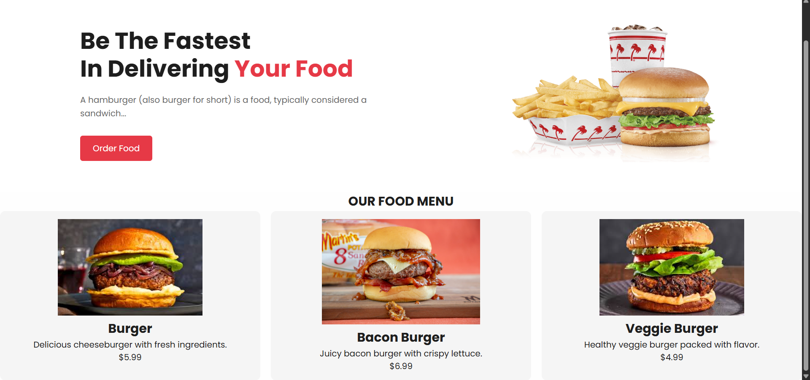

# 🍔 hamBurger Website - HTML Landing Page

## 📌 About the Project

This is a **Burger Website Landing Page** built using only **HTML**.  
It is my **Day 3 project** of the **#100DaysOfCode** challenge. I'm currently learning the basics of web development, and this project helped me practice creating a structured layout with food item cards.

> ⚠️ Note: The CSS used in this project is **AI-generated** since I'm still learning how to write custom CSS. The main goal here was to improve my **HTML structuring and semantic skills**.

---

## 💡 What I Built

- A hero section with a catchy heading, subtext, and CTA button
- Burger images with prices and descriptions
- A clean layout for food menu using cards
- HTML5 semantic structure using tags like `section`, `article`, `div`, and `img`

---

## 🧠 What I Learned

- Organizing content with sections and semantic elements  
- Creating product-style cards for food items  
- Adding images and aligning text properly  
- Clean, readable HTML code with consistent indentation

## 🗂️ Project Structure

📁 Burger Website Project
├── index.html          # Main HTML file
├── style.css           # AI-generated styling (optional)
├── images/             # Folder for burger images
└── README.md           # This file

## 🖼️ Preview

> 

## 🚀 How to Use

1. Clone the repository:
   ``bash
  git clone https://github.com/Shibudas-dev/hamburger
``

2. Open `index.html` in your browser.
3. Done! You can now view the landing page.

## 🙋‍♂️ About Me

I’m a **3rd semester Diploma CSE student** currently learning web development step by step.
This is my third HTML-only project as part of my **developer journey**, with the goal of becoming a skilled **Front-End Developer** and working in **Japan 🇯🇵** one day.

## 🔗 Connect with Me

* 💼 LinkedIn: [https://linkedin.com/in/YOUR\_USERNAME](https://www.linkedin.com/in/shibu-das-1a1911335/)
* 🐦 Twitter: [https://x.com/shibudas\_dev](https://x.com/shibudas_dev)
